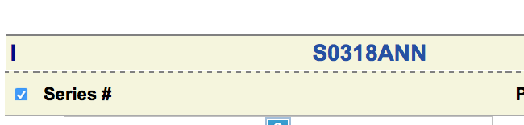
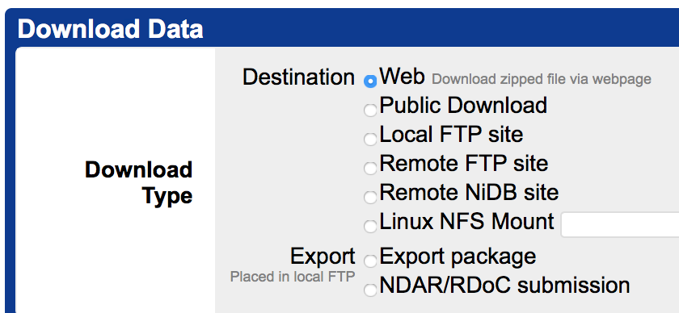
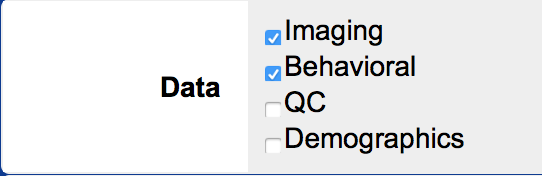
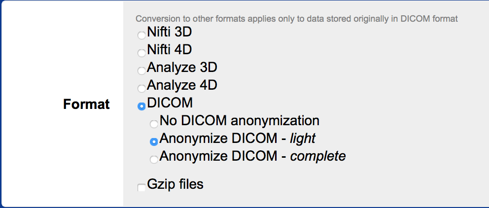
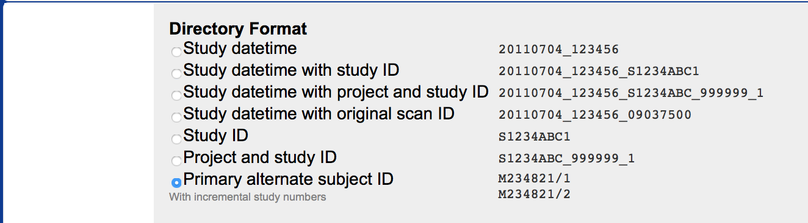
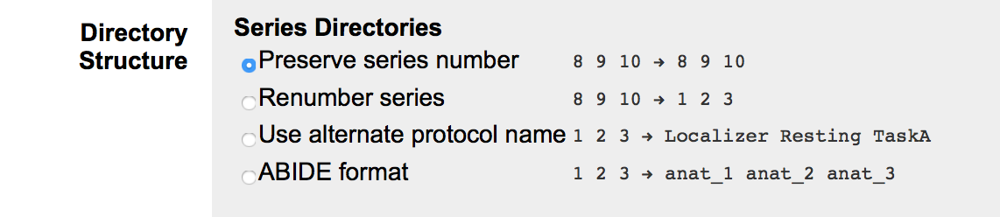

# HW 2
Due by 11:59pm the evening of 9/24.

## Textbook Reading
Read chapter 8.

## Regular Expressions
Write a regular expression to extract (i.e. store in a regex group) the *italicized* portions of the following strings. The same regex should work for each set of strings.

Your expressions will be evaluated using the python mode of [regex101.com](http://regex101.com)

#####A BIDS-style file name (set 1)

- sub-*1000*\_task-*nback*\_acq-*singleband*\_run-*03*\_*bold*
- sub-*EXP23*\_task-*rest*\_acq-*multiband*\_run-*01*\_*bold*

#####A 10 digit US phone number (set 2):
You should capture 3 groups, containing the area code, exchange and number, but not any separators or country code.

- +1 *123*\-*456*\-*7891*
- (*123*) *555*-*5555*
- *860*.*865*.*9805*
- 1-*800*-*865*-*9805*

Submit your two regular expressions in a Markdown file `regex/README.md`


## Discussion Paper Reading

Read at least one of the papers posted in #discussion on Slack and be prepared to discuss in class. Feel free to discuss in the #discussion channel before class!

## Start Learning Python

Although shell scripting is a useful tool that we will continue to rely on, some things are better done in a more powerful language such as Python. Begin the free modules of the [Python Code Academy course](https://www.codecademy.com/learn/learn-python). You should try to get 1/3 to 1/2 through or so.


## Overview
In this homework, you will practice downloading your data from NiDB and converting it into a [BIDS](http://bids.neuroimaging.io) structure.

- Input: a directory of DICOM files downloaded from NiDB, possibly containing subdirectories
- Output: a directory of NIFTI files, organized in BIDS format
- Method: You will accomplish the conversion by writing a script (located at `scripts/convert.sh` with respect to the hw2 repository) that can be run in a container as

```
docker run [-v ...] rhancock/burc-lite <PATH>/convert.sh PARTICIPANT
```

where

- `[-v ...]` is replaced by appropriate options to attach parts of your local filesystem as volumes to the container
- `<PATH>/convert.sh` is the appropriate path to the script
- `PARTICIPANT` is the identifier for the participant to convert.

## Download the data

Download the IBRAIN002 (S0318ANN) data from [NiDB](http://psypacs.psy.uconn.edu/nidb/index.php). More documentation about NiDB is available on the [Wiki](http://birc-int.psy.uconn.edu/wiki/index.php/NiDB_User_Guide)

The appropriate export options are below














After downloading the data, unzip the file, which will create a directory named `IBRAIN002`

## Directory structure

1. Fork and clone the `bircibrain/hw2` repository to your computer
2. Create the following directories in your `hw2` folder:
	- `bids/`, for your BIDS-compliant output directory
	- `raw/`, for the DICOMs you downloaded from NiDB
	- The existing scripts folder is where you will put your code
3. Place the `IBRAIN002` folder (the folder, not the contents) in your `raw` directory.

## Run the container

Run the `rhancock/burc-lite` Docker container interactively with the appropriate `-v` flags to attach your `hw2` directory inside the container. You can attach to `/bind` inside the container. You should also include `-v /tmp:/tmp`.

## Generate BIDS sidecars
Use the `dcm2bids_helper` command inside the container to extract metadata from the DICOM files. This takes two arguments:
- `-d DICOM_DIR`, where `DICOM_DIR` is the path to the `IBRAIN002`
- `-o OUTPUT_DIR`, where `OUTPUT_DIR` is the path where the BIDS files will go

This will convert the DICOMs and create some json files containing information about the scans.

## Edit `scripts/dcm2bids.json`

`scripts/dcm2bids.json` contains the dictionary that matches converted DICOM files to their corresponding BIDS structure.

It contains several sections of the form:

```
{
  "dataType": "func",
  "modalityLabel": "sbref",
  "customLabels": "task-words",
  "criteria": {
      "ProtocolName": "INSERT Correct ProtocolName",
      "ImageComments": "Single-band_reference",
      "PhaseEncodingDirection": "j-"
  }
},
```

for each of these, you will need to replace the `ProtocolName` value in `scripts/dcm2bids.json` with the appropriate `ProtocolName` from the json file corresponding to the scan. Do this for for the 
for the following `"modalityLabel": "sbref"`

```
007_IBRAIN002_fMRI_words_run1_20171114132143
013_IBRAIN002_fMRI_motor_localizer_20171114132143.nii.gz
```

and the following `"modalityLabel": "bold"` scan series:

```
008_IBRAIN002_fMRI_words_run1_20171114132143.nii.gz
014_IBRAIN002_fMRI_motor_localizer_20171114132143.nii.gz
```

## Create the conversion script
Use the `dcm2bids` command inside the container to convert the files. You should modify `scripts/convert.sh` to add the appropriate commands at line 4.

In the interactive container, you can run

```
dcm2bids -h
``` 

to view the documentation.

You will want to set appropriate values for `-d`, `-p` (IBRAIN002), `-c` (the `dcm2bids.json` file), and `-o`.

## Hints

- Consider which paths need to be referenced relative to your own computer and which need to referenced relative to the container
- Shell scripts can take arguments. These can be referred to using the special variable references `$1`, `$2`, ..., where `$1` provides the value of the first argument after the script name. It would be useful to use `$1` to control which participant is processed.
- [Documentation for `dcm2bids`](https://github.com/cbedetti/Dcm2Bids/)


## Submit

Commit your work and create a pull request. The data files will not be committed to conserve space.


